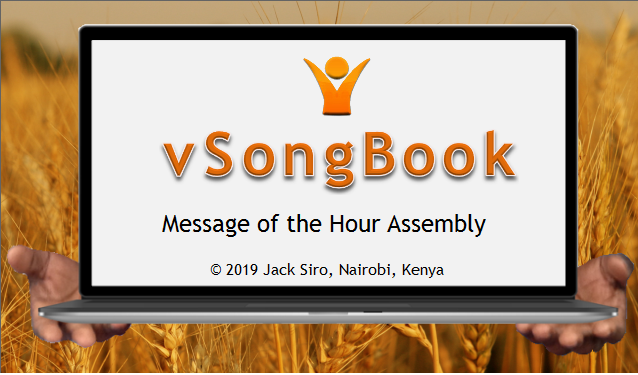
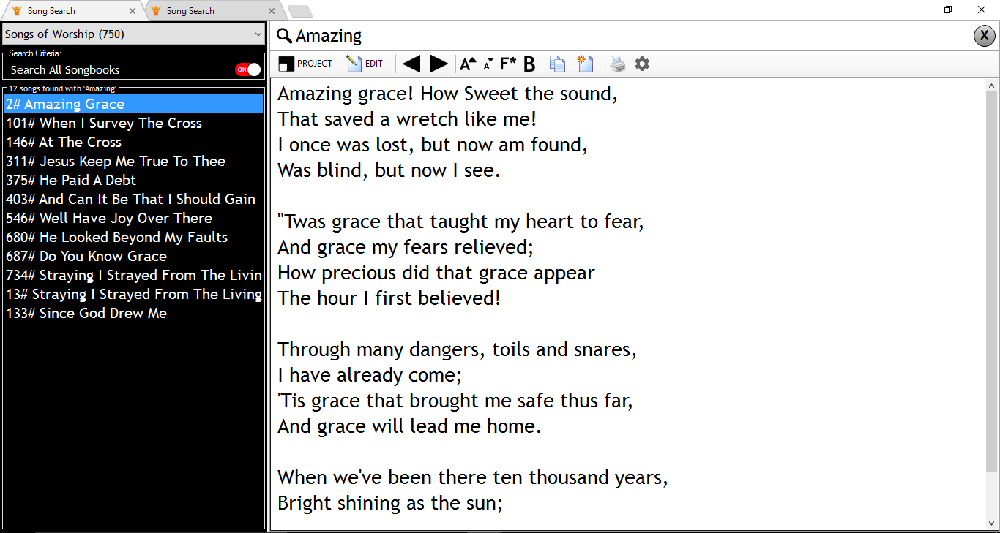

# vSongBook-Windows
vSongBook is an app that seeks to give its users the freedom to be sing anywhere anytime provided they have the latest version installed on their device. This is the respiratory for vSongBook built for Windows Machine using Visual Studio 2017 and Sqlite database to make it faster and reliable

## Screenshots
 vSongBook splash screen

 vSongBook main Page
